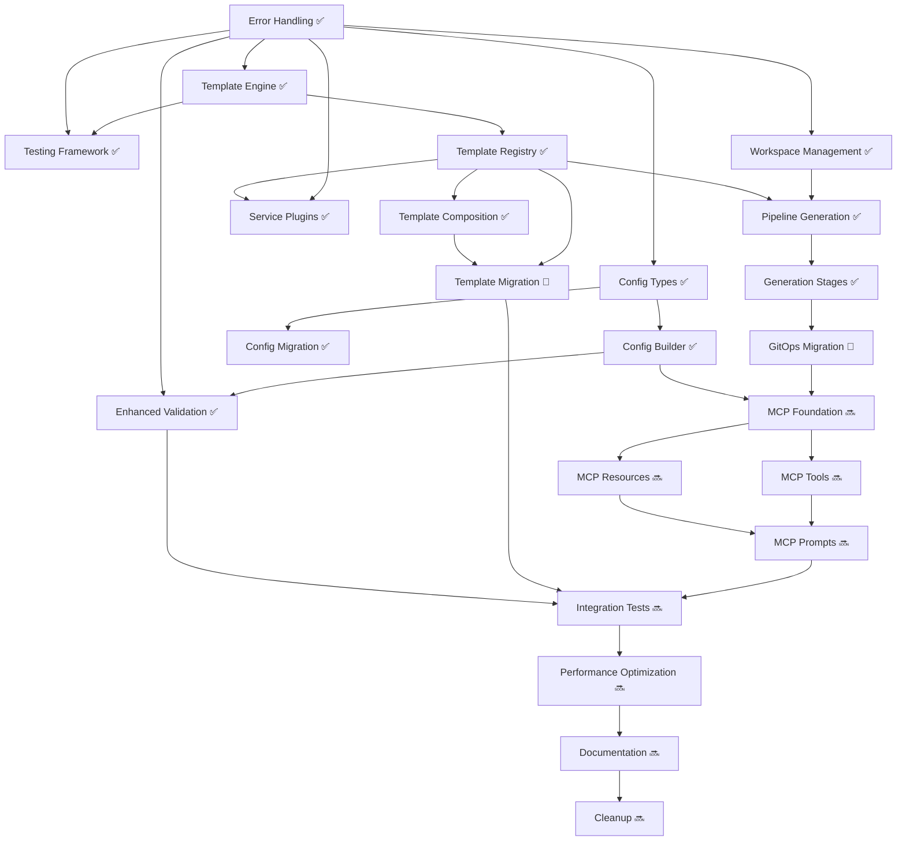

# Implementation Tasks

## Overview

This document breaks down the configuration system refactor into discrete, implementable tasks. Each task is designed to be completed independently while building toward the complete refactored system. Tasks are organized by implementation phases and include clear acceptance criteria.

## Phase 1: Foundation (Weeks 1-2) ✅ COMPLETED

### Task 1.1: Core Error Handling System ✅
**Status:** COMPLETED
**Dependencies:** None

**Description:** Implement the foundational error handling system with typed errors, context, and aggregation.

**Acceptance Criteria:**
- [x] All error types are properly defined and documented
- [x] Error aggregation collects multiple errors correctly
- [x] Error context includes file paths, line numbers, and operation details
- [x] Error suggestions provide actionable guidance
- [x] Unit tests achieve 95%+ coverage

**Completed Files:**
- `internal/util/errors/interfaces.go`
- `internal/util/errors/error_aggregator.go`
- `internal/util/errors/error_handler.go`
- `internal/util/errors/error_wrapper.go`
- `internal/util/errors/errors_test.go`

### Task 1.2: Template Engine Interface and Base Implementation ✅
**Status:** COMPLETED
**Dependencies:** Task 1.1

**Description:** Create the template engine abstraction and implement the Go template engine with caching and validation.

**Acceptance Criteria:**
- [x] Template engine interface is clean and extensible
- [x] Go template engine supports all existing template features
- [x] Template caching improves performance measurably
- [x] Template validation catches syntax errors before rendering
- [x] Error messages include line numbers and context
- [x] Golden file tests validate template output

**Completed Files:**
- `internal/template/engine.go`
- `internal/template/cache.go`
- `internal/template/context.go`
- `internal/template/engine_test.go`
- `internal/template/engine_golden_test.go`

### Task 1.3: Testing Framework Setup ✅
**Status:** COMPLETED
**Dependencies:** Task 1.1, Task 1.2

**Description:** Establish the testing framework with property-based testing, mocks, and test utilities.

**Acceptance Criteria:**
- [x] Test framework provides consistent testing environment
- [x] Mock implementations support all interface methods
- [x] Property-based tests validate core invariants
- [x] Test data generators create realistic test scenarios
- [x] Benchmark tests measure performance regressions

**Completed Files:**
- `internal/testing/framework.go`
- `internal/testing/mocks.go`
- `internal/testing/generators.go`
- `internal/testing/benchmarks.go`
- `internal/testing/*_test.go`

## Phase 2: Configuration System (Weeks 3-4) ✅ COMPLETED

### Task 2.1: Enhanced Configuration Types ✅
**Status:** COMPLETED
**Dependencies:** Task 1.1

**Description:** Extend the configuration types with metadata, versioning, and enhanced validation support.

**Acceptance Criteria:**
- [x] Configuration includes creation/update timestamps
- [x] Schema versioning supports migration detection
- [x] Configuration metadata is preserved during operations
- [x] Configuration comparison detects all changes
- [x] JSON schema validates enhanced configuration structure

**Completed Files:**
- `internal/config/config.go`
- `internal/config/metadata.go`
- `internal/config/comparison.go`
- `internal/config/schema.go`

### Task 2.2: Configuration Builder Implementation ✅
**Status:** COMPLETED
**Dependencies:** Task 2.1, Task 1.2

**Description:** Implement the fluent configuration builder with type safety and validation.

**Acceptance Criteria:**
- [x] Fluent API supports method chaining for all configuration options
- [x] Type safety prevents invalid configuration paths at compile time
- [x] Validation errors are aggregated and reported with context
- [x] Builder supports conditional configuration based on provider
- [x] Property-based tests validate builder invariants

**Completed Files:**
- `internal/config/builder.go`
- `internal/config/paths.go` (type-safe paths)
- `internal/config/builder_test.go`
- `internal/config/builder_property_test.go`

### Task 2.3: Configuration Migration System ✅
**Status:** COMPLETED
**Dependencies:** Task 2.1

**Description:** Implement versioned configuration migration with validation and rollback support.

**Acceptance Criteria:**
- [x] Migration manager supports all version transitions
- [x] Configuration values are preserved during migration
- [x] Migration validation prevents invalid version paths
- [x] Dry-run mode previews migration changes safely
- [x] Rollback capability restores original configuration

**Completed Files:**
- `internal/config/migration.go`
- `internal/config/migrator.go`
- `internal/config/versions.go`
- `internal/config/migration_test.go`
- `internal/config/migration_property_test.go`

### Task 2.4: Enhanced Configuration Validation ✅
**Status:** COMPLETED
**Dependencies:** Task 2.2, Task 1.1

**Description:** Enhance configuration validation with detailed error reporting and suggestions.

**Acceptance Criteria:**
- [x] Validation errors include field paths and suggestions
- [x] Cross-field validation catches configuration conflicts
- [x] Provider-specific validation enforces provider requirements
- [x] Validation suggestions guide users to correct configurations
- [x] Validation performance is acceptable for large configurations

**Completed Files:**
- `internal/config/validator.go`
- `internal/config/enhanced_validator.go`
- `internal/config/suggestions.go`
- `internal/config/validator_*_test.go`

## Phase 3: Template System (Weeks 5-6) ✅ MOSTLY COMPLETED

### Task 3.1: Template Registry Implementation ✅
**Status:** COMPLETED
**Dependencies:** Task 1.2

**Description:** Implement the template registry with metadata management and dependency resolution.

**Acceptance Criteria:**
- [x] Template registry manages all template metadata correctly
- [x] Template dependencies are resolved in correct order
- [x] Provider filtering returns only compatible templates
- [x] Service filtering excludes disabled service templates
- [x] Template registration validates dependencies and conditions

**Completed Files:**
- `internal/template/registry.go`
- `internal/template/metadata.go`
- `internal/template/dependencies.go`
- `internal/template/registry_test.go`
- `internal/template/registry_property_test.go`
- `internal/template/registry_benchmark_test.go`

### Task 3.2: Template Composition System ✅
**Status:** COMPLETED
**Dependencies:** Task 3.1

**Description:** Implement template composition with base templates, overlays, and patches.

**Acceptance Criteria:**
- [x] Base templates can be extended with overlays correctly
- [x] Overlay priority ordering is deterministic and configurable
- [x] Patch system supports add, remove, and replace operations
- [x] Composition validation prevents incompatible combinations
- [x] Conflict resolution provides clear error messages

**Completed Files:**
- `internal/template/composition.go`
- `internal/template/composition_test.go`
- `internal/template/composition_integration_test.go`

### Task 3.3: Service Plugin Architecture ✅
**Status:** COMPLETED
**Dependencies:** Task 1.1, Task 3.1

**Description:** Implement the service plugin system with dynamic loading and lifecycle management.

**Acceptance Criteria:**
- [x] Service plugins can be loaded dynamically from manifests
- [x] Service dependencies are resolved correctly with cycle detection
- [x] Plugin lifecycle hooks execute at appropriate times
- [x] Built-in services are migrated to plugin architecture
- [x] Service status reporting provides accurate information

**Completed Files:**
- `internal/services/registry.go`
- `internal/services/plugin.go`
- `internal/services/lifecycle_test.go`
- `internal/services/circular_dependency_test.go`
- `internal/services/registry_test.go`
- `internal/services/plugins/` (directory with built-in plugins)

### Task 3.4: Template Migration from Legacy System
**Status:** IN PROGRESS
**Dependencies:** Task 3.1, Task 3.2

**Description:** Migrate existing template processing to use the new template system while maintaining compatibility.

**Implementation Steps:**
1. Create compatibility layer for existing template calls
2. Migrate embedded templates to new registry system
3. Update template rendering in GitOps generation
4. Add feature flag for gradual migration
5. Validate output compatibility with legacy system
d
**Acceptance Criteria:**
- [x] Existing template calls work without modification
- [x] All embedded templates are registered in new system
- [x] Template output is identical to legacy system
- [x] Feature flag allows switching between old and new systems
- [x] Migration path is documented and tested

**Files to Create/Modify:**
- `internal/template/legacy.go` (partially complete)
- `internal/gitops/copy.go` (needs modification)
- `internal/gitops/embed.go` (needs modification)
- `internal/template/migration_test.go` (needs completion)

**Remaining Work:**
- Complete integration with GitOps generation pipeline
- Add feature flag support
- Validate output compatibility
- Complete migration tests

## Phase 4: GitOps Generation (Weeks 7-8) ✅ MOSTLY COMPLETED

### Task 4.1: GitOps Workspace Management ✅
**Status:** COMPLETED
**Dependencies:** Task 1.1

**Description:** Implement workspace management with checkpointing and rollback capabilities.

**Acceptance Criteria:**
- [x] Workspace provides isolated environment for generation
- [x] Checkpointing captures workspace state at any point
- [x] Rollback restores workspace to previous checkpoint
- [x] Atomic operations prevent partial file writes
- [x] Resource cleanup prevents workspace leaks

**Completed Files:**
- `internal/gitops/workspace.go`
- `internal/gitops/checkpoint.go`
- `internal/gitops/atomic.go`
- `internal/gitops/workspace_test.go`
- `internal/gitops/workspace_integration_test.go`
- `internal/gitops/workspace_cleanup_test.go`

### Task 4.2: Pipeline-Based GitOps Generation ✅
**Status:** COMPLETED
**Dependencies:** Task 4.1, Task 3.1

**Description:** Implement the pipeline-based GitOps generation system with staged execution and rollback.

**Acceptance Criteria:**
- [x] Generation executes in discrete, rollback-capable stages
- [x] Stage failures trigger automatic rollback of previous stages
- [x] Dry-run mode provides accurate preview without filesystem changes
- [x] Generation progress is reported to users
- [x] Generated repository structure meets all requirements

**Completed Files:**
- `internal/gitops/generator.go`
- `internal/gitops/pipeline.go`
- `internal/gitops/dryrun.go`
- `internal/gitops/dryrun_writer.go`
- `internal/gitops/progress.go`
- `internal/gitops/generator_test.go`

### Task 4.3: Generation Stage Implementations ✅
**Status:** COMPLETED
**Dependencies:** Task 4.2

**Description:** Implement specific generation stages for different aspects of GitOps repository creation.

**Acceptance Criteria:**
- [x] Base structure stage creates correct directory layout
- [x] Infrastructure stage generates provider-specific templates
- [x] Service stage generates enabled service configurations
- [x] Configuration stage creates cluster-specific configs
- [x] Validation stage verifies repository completeness

**Completed Files:**
- `internal/gitops/stages/` (directory with stage implementations)

### Task 4.4: Legacy GitOps Generation Migration
**Status:** IN PROGRESS
**Dependencies:** Task 4.3

**Description:** Migrate existing GitOps generation logic to use the new pipeline system.

**Implementation Steps:**
1. Create compatibility wrapper for existing generation calls
2. Map existing generation logic to new pipeline stages
3. Update CLI commands to use new generation system
4. Add feature flag for gradual migration
5. Validate output compatibility with existing system

**Acceptance Criteria:**
- [ ] Existing generation calls work without modification
- [ ] Generated output is identical to legacy system
- [ ] CLI commands use new generation system transparently
- [ ] Feature flag allows switching between systems
- [ ] Migration preserves all existing functionality

**Files to Create/Modify:**
- `internal/gitops/legacy_compat.go` (partially complete)
- `cmd/cluster_init.go` (needs modification)
- `cmd/cluster_bootstrap.go` (needs modification)
- `internal/gitops/migration_test.go` (needs completion)

**Remaining Work:**
- Complete CLI command integration
- Add feature flag support
- Validate output compatibility
- Complete migration tests

## Phase 5: MCP Server and Integration (Weeks 9-12) 🚧 NOT STARTED

### Task 5.1: MCP Server Foundation
**Status:** NOT STARTED
**Estimated Effort:** 4 days
**Dependencies:** Task 4.4, Task 2.2

**Description:** Implement the foundational MCP server with authentication, session management, and basic tool/resource framework.

**Implementation Steps:**
1. Create MCP server interface and implementation using mcp-go library
2. Implement authentication providers (file-based and OIDC)
3. Add session management with user context and permissions
4. Create audit logging system for MCP operations
5. Implement comprehensive MCP server tests

**Acceptance Criteria:**
- [ ] MCP server starts and accepts connections via stdio and HTTP transports
- [ ] Authentication providers validate user credentials correctly
- [ ] Session management maintains user context and permissions
- [ ] Audit logging captures all MCP operations with full context
- [ ] Security controls prevent unauthorized access to cluster operations

**Files to Create:**
- `internal/mcp/server.go`
- `internal/mcp/auth.go`
- `internal/mcp/session.go`
- `internal/mcp/audit.go`
- `internal/mcp/server_test.go`
- `cmd/mcp_server.go`

**Requirements Validated:** 13.1, 13.2, 13.5, 13.6

### Task 5.2: MCP Cluster Management Tools
**Status:** NOT STARTED
**Estimated Effort:** 5 days
**Dependencies:** Task 5.1

**Description:** Implement MCP tools for cluster lifecycle operations with proper permission validation and error handling.

**Implementation Steps:**
1. Create cluster initialization tool with configuration validation
2. Implement cluster validation tool with detailed error reporting
3. Add GitOps generation tool with dry-run capabilities
4. Create cluster status and information tools
5. Implement cluster update and destroy tools with safety checks

**Acceptance Criteria:**
- [ ] Cluster init tool creates valid configurations through MCP interface
- [ ] Validation tool provides detailed feedback on configuration issues
- [ ] GitOps generation tool supports dry-run mode for safe previews
- [ ] Status tools provide real-time cluster information
- [ ] Destructive operations require explicit confirmation and proper permissions

**Files to Create:**
- `internal/mcp/tools/cluster.go`
- `internal/mcp/tools/validation.go`
- `internal/mcp/tools/gitops.go`
- `internal/mcp/tools/status.go`
- `internal/mcp/tools/cluster_test.go`

**Requirements Validated:** 13.1, 13.2

### Task 5.3: MCP Configuration Resources
**Status:** NOT STARTED
**Estimated Effort:** 3 days
**Dependencies:** Task 5.1

**Description:** Implement MCP resources for accessing and analyzing cluster configurations with proper access controls.

**Implementation Steps:**
1. Create configuration resource handlers for reading cluster configs
2. Implement template resource access with provider filtering
3. Add schema resource for configuration validation assistance
4. Create service registry resource for available services
5. Implement configuration comparison and diff resources

**Acceptance Criteria:**
- [ ] Configuration resources respect organization and cluster scoping
- [ ] Template resources filter based on provider and service enablement
- [ ] Schema resources provide up-to-date validation information
- [ ] Service resources show available services with dependency information
- [ ] Diff resources provide clear configuration comparison capabilities

**Files to Create:**
- `internal/mcp/resources/config.go`
- `internal/mcp/resources/templates.go`
- `internal/mcp/resources/schema.go`
- `internal/mcp/resources/services.go`
- `internal/mcp/resources/resources_test.go`

**Requirements Validated:** 13.3, 13.6

### Task 5.4: MCP Guidance Prompts
**Status:** NOT STARTED
**Estimated Effort:** 3 days
**Dependencies:** Task 5.2, Task 5.3

**Description:** Create MCP prompts that guide AI assistants in cluster management best practices and troubleshooting.

**Implementation Steps:**
1. Create cluster initialization guidance prompts with provider-specific advice
2. Implement troubleshooting prompts for common configuration issues
3. Add best practices prompts for security and performance optimization
4. Create service selection guidance based on use case requirements
5. Implement migration assistance prompts for configuration updates

**Acceptance Criteria:**
- [ ] Initialization prompts guide users through provider-specific setup
- [ ] Troubleshooting prompts help diagnose and resolve common issues
- [ ] Best practices prompts promote secure and performant configurations
- [ ] Service selection prompts recommend appropriate services for use cases
- [ ] Migration prompts assist with safe configuration updates

**Files to Create:**
- `internal/mcp/prompts/initialization.go`
- `internal/mcp/prompts/troubleshooting.go`
- `internal/mcp/prompts/best_practices.go`
- `internal/mcp/prompts/services.go`
- `internal/mcp/prompts/prompts_test.go`

**Requirements Validated:** 13.4

### Task 5.5: End-to-End Integration Tests
**Status:** NOT STARTED
**Estimated Effort:** 3 days
**Dependencies:** All previous tasks

**Description:** Create comprehensive integration tests that validate the complete refactored system including MCP server functionality.

**Implementation Steps:**
1. Create integration test framework for complete workflows including MCP
2. Implement tests for all supported provider configurations via MCP
3. Add tests for service combinations and edge cases through MCP interface
4. Create performance regression tests including MCP overhead
5. Implement compatibility tests with legacy configurations

**Acceptance Criteria:**
- [ ] Integration tests cover all major workflow scenarios including MCP paths
- [ ] Provider-specific tests validate all supported providers via MCP
- [ ] Service combination tests verify plugin interactions through MCP
- [ ] Performance tests detect regressions including MCP server overhead
- [ ] Compatibility tests ensure backward compatibility through all interfaces

**Files to Create/Modify:**
- `tests/integration/complete_workflow_test.go`
- `tests/integration/mcp_server_test.go`
- `tests/integration/provider_test.go`
- `tests/integration/service_test.go`
- `tests/integration/performance_test.go`

**Requirements Validated:** All requirements

### Task 5.6: Performance Optimization
**Status:** NOT STARTED
**Estimated Effort:** 2 days
**Dependencies:** Task 5.5

**Description:** Optimize system performance including MCP server responsiveness based on benchmark results and profiling.

**Implementation Steps:**
1. Profile system performance with realistic workloads including MCP operations
2. Optimize template caching and rendering performance for MCP resource access
3. Improve configuration building and validation speed for MCP tools
4. Optimize GitOps generation for large repositories via MCP
5. Validate performance improvements with benchmarks including MCP overhead

**Acceptance Criteria:**
- [ ] MCP server response times meet acceptable thresholds for interactive use
- [ ] Template rendering performance meets or exceeds legacy system via MCP
- [ ] Configuration building is faster than reflection-based approach via MCP
- [ ] GitOps generation scales well with repository size through MCP interface
- [ ] Memory usage is optimized for concurrent MCP sessions

**Files to Create/Modify:**
- `internal/template/optimization.go`
- `internal/config/optimization.go`
- `internal/gitops/optimization.go`
- `internal/mcp/optimization.go`
- `benchmarks/mcp_benchmarks.go`

**Requirements Validated:** 9.1, 9.2, 9.3

### Task 5.7: Documentation and Examples
**Status:** NOT STARTED
**Estimated Effort:** 4 days
**Dependencies:** Task 5.6

**Description:** Create comprehensive documentation and examples for the refactored system including MCP server usage.

**Implementation Steps:**
1. Document all new interfaces including MCP server API
2. Create migration guide from legacy system including MCP setup
3. Add examples for common configuration patterns via MCP
4. Document MCP server deployment and authentication setup
5. Create AI assistant integration guide and troubleshooting documentation

**Acceptance Criteria:**
- [ ] All public interfaces are documented with examples including MCP tools
- [ ] Migration guide provides clear step-by-step instructions including MCP setup
- [ ] Configuration examples cover common use cases accessible via MCP
- [ ] MCP server documentation enables easy deployment and integration
- [ ] AI assistant guide demonstrates effective cluster management workflows

**Files to Create/Modify:**
- `docs/architecture/refactored-system.md`
- `docs/mcp/server-setup.md`
- `docs/mcp/ai-assistant-guide.md`
- `docs/migration/legacy-to-refactored.md`
- `docs/examples/mcp-workflows.md`

**Requirements Validated:** 12.1, 12.2, 12.3, 12.4, 12.5, 12.6

### Task 5.8: Feature Flag Removal and Cleanup
**Status:** NOT STARTED
**Estimated Effort:** 2 days
**Dependencies:** Task 5.7

**Description:** Remove feature flags and legacy code after successful migration validation.

**Implementation Steps:**
1. Validate all functionality works with new system
2. Remove feature flags and legacy compatibility code
3. Clean up unused imports and dependencies
4. Update build and test configurations
5. Perform final validation of cleaned system

**Acceptance Criteria:**
- [ ] All functionality works without feature flags
- [ ] Legacy code is completely removed
- [ ] Build system is updated for new architecture
- [ ] Test suite passes completely
- [ ] System is ready for production use

**Files to Modify:**
- Remove legacy compatibility files
- Update build configurations
- Clean up test configurations
- Update CI/CD pipelines

**Requirements Validated:** 10.1, 10.2, 10.3, 10.4, 10.5, 10.6

## Summary of Current Status

### ✅ Completed (Phases 1-3)
- **Phase 1: Foundation** - All core infrastructure is in place
  - Error handling system with structured errors and aggregation
  - Template engine with caching, validation, and error reporting
  - Testing framework with property-based testing and mocks

- **Phase 2: Configuration System** - Configuration management is complete
  - Enhanced configuration types with metadata and versioning
  - Fluent configuration builder with type-safe paths
  - Configuration migration system with rollback support
  - Enhanced validation with detailed error reporting and suggestions

- **Phase 3: Template System** - Template infrastructure is complete
  - Template registry with metadata and dependency resolution
  - Template composition with overlays and patches
  - Service plugin architecture with lifecycle management

### 🚧 In Progress (Phase 4)
- **Phase 4: GitOps Generation** - Core infrastructure complete, migration in progress
  - ✅ Workspace management with checkpointing and rollback
  - ✅ Pipeline-based generation with staged execution
  - ✅ Generation stage implementations
  - 🚧 Legacy GitOps generation migration (needs CLI integration and feature flags)
  - 🚧 Template migration from legacy system (needs completion)

### 🔜 Not Started (Phase 5)
- **Phase 5: MCP Server and Integration** - Entire phase needs implementation
  - MCP server foundation with authentication and session management
  - MCP cluster management tools
  - MCP configuration resources
  - MCP guidance prompts
  - End-to-end integration tests
  - Performance optimization
  - Documentation and examples
  - Feature flag removal and cleanup

## Next Steps

### Immediate Priority (Complete Phase 4)
1. **Task 3.4**: Complete template migration from legacy system
   - Integrate new template system with GitOps generation
   - Add feature flag support for gradual migration
   - Validate output compatibility with legacy system

2. **Task 4.4**: Complete legacy GitOps generation migration
   - Update CLI commands to use new generation system
   - Add feature flag support
   - Validate output compatibility

### Medium Priority (Start Phase 5)
3. **Task 5.1**: Implement MCP server foundation
   - Set up MCP server with authentication
   - Implement session management
   - Add audit logging

4. **Task 5.2-5.4**: Implement MCP tools, resources, and prompts
   - Create cluster management tools
   - Implement configuration resources
   - Add guidance prompts for AI assistants

### Long-term Priority (Complete Phase 5)
5. **Task 5.5-5.8**: Integration, optimization, and cleanup
   - End-to-end integration tests
   - Performance optimization
   - Documentation
   - Feature flag removal

## Estimated Completion

- **Phase 4 Completion**: 1-2 weeks (2 tasks remaining)
- **Phase 5 Completion**: 4-6 weeks (8 tasks remaining)
- **Total Remaining**: 5-8 weeks

## Task Dependencies



Legend:
- ✅ Completed
- 🚧 In Progress
- 🔜 Not Started T5.3[MCP Resources]
    T5.2 --> T5.4[MCP Prompts]
    T5.3 --> T5.4
    T5.4 --> T5.5[Integration Tests]
    T3.4 --> T5.5
    T2.4 --> T5.5
    T5.5 --> T5.6[Performance Optimization]
    T5.6 --> T5.7[Documentation]
    T5.7 --> T5.8[Cleanup]
```

## Risk Mitigation

### High-Risk Tasks
- **Task 3.4 & 4.4**: Legacy system migration - Risk of breaking existing functionality
- **Task 5.2**: Performance optimization - Risk of introducing bugs during optimization

### Mitigation Strategies
1. **Comprehensive Testing**: Each task includes extensive testing requirements
2. **Feature Flags**: Gradual migration with ability to rollback
3. **Compatibility Validation**: Automated comparison with legacy system output
4. **Incremental Delivery**: Each phase delivers working functionality
5. **Code Review**: All changes require thorough code review

## Success Criteria

The refactor is considered successful when:
1. All existing functionality works without modification
2. New system provides better maintainability and extensibility
3. Performance is equal to or better than legacy system
4. All tests pass including property-based and integration tests
5. Documentation enables easy adoption and contribution
6. Migration path is clear and well-documented