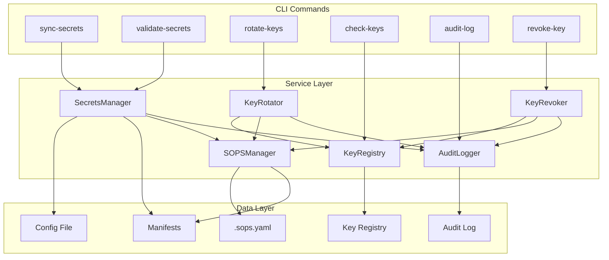

# Design Document: Multi-Cluster Secrets Management

## Overview

This design document describes the architecture and implementation for multi-cluster secrets management improvements to the openCenter-cli. The feature provides a comprehensive solution for managing secrets across multiple Kubernetes clusters, addressing configuration drift, key lifecycle management, and security compliance requirements.

The implementation extends the existing CLI architecture by adding new commands under `opencenter cluster` and introducing new internal packages for secrets synchronization, drift detection, key registry management, and enhanced audit logging.

## Architecture

The multi-cluster secrets management feature follows a layered architecture that integrates with existing openCenter-cli components:

```
┌─────────────────────────────────────────────────────────────────────────────┐
│                              CLI Layer (cmd/)                               │
│  ┌──────────────┐ ┌──────────────┐ ┌──────────────┐ ┌──────────────────────┐│
│  │sync-secrets  │ │validate-     │ │rotate-keys   │ │check-keys/audit-log/ ││
│  │              │ │secrets       │ │              │ │revoke-key/install-   ││
│  │              │ │              │ │              │ │hooks/keys            ││
│  └──────┬───────┘ └──────┬───────┘ └──────┬───────┘ └──────────┬───────────┘│
└─────────┼────────────────┼────────────────┼────────────────────┼────────────┘
          │                │                │                    │
┌─────────▼────────────────▼────────────────▼────────────────────▼────────────┐
│                         Service Layer (internal/)                           │
│  ┌─────────────────────────────────────────────────────────────────────────┐│
│  │                    secrets/manager.go (NEW)                             ││
│  │  - SecretsManager interface                                             ││
│  │  - SyncSecrets(), ValidateSecrets(), DetectDrift()                      ││
│  └─────────────────────────────────────────────────────────────────────────┘│
│  ┌─────────────────────────────────────────────────────────────────────────┐│
│  │                    secrets/registry.go (NEW)                            ││
│  │  - KeyRegistry interface                                                ││
│  │  - RegisterKey(), GetKey(), UpdateKeyStatus(), ListKeys()               ││
│  └─────────────────────────────────────────────────────────────────────────┘│
│  ┌─────────────────────────────────────────────────────────────────────────┐│
│  │                    secrets/rotation.go (NEW)                            ││
│  │  - KeyRotator interface                                                 ││
│  │  - RotateAgeKey(), RotateSSHKey(), CompleteRotation()                   ││
│  └─────────────────────────────────────────────────────────────────────────┘│
│  ┌─────────────────────────────────────────────────────────────────────────┐│
│  │                    secrets/revocation.go (NEW)                          ││
│  │  - KeyRevoker interface                                                 ││
│  │  - RevokeByUser(), RevokeByFingerprint(), EmergencyRevoke()             ││
│  └─────────────────────────────────────────────────────────────────────────┘│
│  ┌─────────────────────────────────────────────────────────────────────────┐│
│  │              Existing: sops/manager.go, sops/key_manager.go             ││
│  │              Existing: security/audit_logger.go                         ││
│  │              Existing: operations/drift_detector.go                     ││
│  └─────────────────────────────────────────────────────────────────────────┘│
└─────────────────────────────────────────────────────────────────────────────┘
          │                │                │                    │
┌─────────▼────────────────▼────────────────▼────────────────────▼────────────┐
│                         Data Layer                                          │
│  ┌──────────────────┐ ┌──────────────────┐ ┌──────────────────────────────┐ │
│  │ Config Files     │ │ Key Registry     │ │ Audit Log                    │ │
│  │ .k8s-*-config.   │ │ secrets/key-     │ │ ~/.config/opencenter/audit/  │ │
│  │ yaml             │ │ registry.yaml    │ │ secrets-audit.log            │ │
│  └──────────────────┘ └──────────────────┘ └──────────────────────────────┘ │
│  ┌──────────────────┐ ┌──────────────────┐                                  │
│  │ Encrypted        │ │ SOPS Config      │                                  │
│  │ Manifests        │ │ .sops.yaml       │                                  │
│  │ applications/    │ │                  │                                  │
│  │ overlays/*/      │ │                  │                                  │
│  └──────────────────┘ └──────────────────┘                                  │
└─────────────────────────────────────────────────────────────────────────────┘
```

### Data Flow



## Components and Interfaces

### SecretsManager Interface

The `SecretsManager` is the primary interface for secrets synchronization and drift detection.

```go
// SecretsManager handles secrets synchronization and drift detection
type SecretsManager interface {
    // SyncSecrets regenerates encrypted manifests from config file
    SyncSecrets(ctx context.Context, opts SyncOptions) (*SyncResult, error)
    
    // ValidateSecrets compares config secrets against manifests
    ValidateSecrets(ctx context.Context, opts ValidateOptions) (*ValidationResult, error)
    
    // DetectDrift identifies differences between config and manifests
    DetectDrift(ctx context.Context, cluster string) (*DriftReport, error)
    
    // GetSecretSources returns all secret sources for a cluster
    GetSecretSources(ctx context.Context, cluster string) ([]SecretSource, error)
}

// SyncOptions configures secrets synchronization behavior
type SyncOptions struct {
    Cluster     string   // Target cluster name
    Services    []string // Optional: specific services to sync
    DryRun      bool     // Preview changes without applying
    Force       bool     // Overwrite even if no drift detected
}

// SyncResult contains the outcome of a sync operation
type SyncResult struct {
    Created   []string // Files created
    Updated   []string // Files updated
    Unchanged []string // Files with no changes
    Errors    []SyncError // Any errors encountered
}

// ValidateOptions configures secrets validation behavior
type ValidateOptions struct {
    Cluster    string // Target cluster name
    Fix        bool   // Auto-fix drift by running sync
    OutputJSON bool   // Output in JSON format
}

// ValidationResult contains drift detection findings
type ValidationResult struct {
    Valid            bool           // True if no drift detected
    DriftItems       []DriftItem    // Secrets with drift
    MissingManifests []string       // Config secrets without manifests
    OrphanedSecrets  []string       // Manifest secrets not in config
    SecurityIssues   []SecurityIssue // Unencrypted secrets found
    ExitCode         int            // 0 for valid, 1 for drift
}

// DriftItem represents a single drift detection
type DriftItem struct {
    Service   string // Service name (e.g., "harbor")
    FieldPath string // Path to the differing field
    ConfigVal string // Value in config (masked)
    ManifestVal string // Value in manifest (masked)
}

// SecurityIssue represents an unencrypted secret
type SecurityIssue struct {
    FilePath  string // Path to the file
    FieldPath string // Path to the unencrypted field
    Severity  string // "critical", "high", "medium"
}
```

### KeyRegistry Interface

The `KeyRegistry` manages key metadata, expiration tracking, and lifecycle state.

```go
// KeyRegistry manages key metadata and lifecycle
type KeyRegistry interface {
    // RegisterKey adds a new key to the registry
    RegisterKey(ctx context.Context, entry KeyEntry) error
    
    // GetKey retrieves key metadata by cluster and type
    GetKey(ctx context.Context, cluster string, keyType KeyType) (*KeyEntry, error)
    
    // UpdateKeyStatus updates the status of a key
    UpdateKeyStatus(ctx context.Context, cluster string, keyType KeyType, status KeyStatus) error
    
    // ListKeys returns all keys, optionally filtered by cluster
    ListKeys(ctx context.Context, cluster string) ([]KeyEntry, error)
    
    // CheckExpiration returns keys that are expired or expiring soon
    CheckExpiration(ctx context.Context, warnDays int) (*ExpirationReport, error)
    
    // RebuildFromFiles reconstructs registry from existing key files
    RebuildFromFiles(ctx context.Context, keysDir string) error
}

// KeyEntry represents metadata for a single key
type KeyEntry struct {
    Cluster      string    `yaml:"cluster"`
    KeyType      KeyType   `yaml:"key_type"`      // "age" or "ssh"
    Fingerprint  string    `yaml:"fingerprint"`
    PublicKey    string    `yaml:"public_key"`
    CreatedAt    time.Time `yaml:"created_at"`
    ExpiresAt    time.Time `yaml:"expires_at"`
    Status       KeyStatus `yaml:"status"`        // "active", "archived", "revoked"
    RotatedFrom  string    `yaml:"rotated_from,omitempty"`
    RevokedAt    time.Time `yaml:"revoked_at,omitempty"`
    RevokedBy    string    `yaml:"revoked_by,omitempty"`
    UsedBy       []string  `yaml:"used_by"`       // Paths using this key
}

// KeyType represents the type of encryption key
type KeyType string

const (
    KeyTypeAge KeyType = "age"
    KeyTypeSSH KeyType = "ssh"
)

// KeyStatus represents the lifecycle status of a key
type KeyStatus string

const (
    KeyStatusActive   KeyStatus = "active"
    KeyStatusArchived KeyStatus = "archived"
    KeyStatusRevoked  KeyStatus = "revoked"
)

// ExpirationReport contains key expiration status
type ExpirationReport struct {
    Expired  []KeyExpirationInfo // Keys past expiration
    Warning  []KeyExpirationInfo // Keys expiring within warn period
    Valid    []KeyExpirationInfo // Keys with time remaining
}

// KeyExpirationInfo contains expiration details for a key
type KeyExpirationInfo struct {
    Cluster       string
    KeyType       KeyType
    Fingerprint   string
    DaysRemaining int  // Negative if expired
    ExpiresAt     time.Time
}
```

### KeyRotator Interface

The `KeyRotator` handles key rotation with dual-key transition support.

```go
// KeyRotator handles key rotation operations
type KeyRotator interface {
    // RotateAgeKey generates new Age key and re-encrypts secrets
    RotateAgeKey(ctx context.Context, opts RotateOptions) (*RotationResult, error)
    
    // RotateSSHKey generates new SSH key pair
    RotateSSHKey(ctx context.Context, opts RotateOptions) (*RotationResult, error)
    
    // CompleteRotation removes old key after dual-key period
    CompleteRotation(ctx context.Context, cluster string, keyType KeyType) error
    
    // GetRotationStatus returns current rotation state
    GetRotationStatus(ctx context.Context, cluster string) (*RotationStatus, error)
}

// RotateOptions configures key rotation behavior
type RotateOptions struct {
    Cluster  string // Target cluster
    KeyType  KeyType // "age" or "ssh"
    DryRun   bool   // Preview without changes
    Complete bool   // Complete dual-key rotation
}

// RotationResult contains the outcome of a rotation
type RotationResult struct {
    OldFingerprint  string   // Previous key fingerprint
    NewFingerprint  string   // New key fingerprint
    ReencryptedFiles []string // Files re-encrypted
    ArchivedKeyPath string   // Path to archived old key
    DualKeyActive   bool     // True if in dual-key mode
}

// RotationStatus represents current rotation state
type RotationStatus struct {
    InProgress     bool
    DualKeyActive  bool
    OldKey         *KeyEntry
    NewKey         *KeyEntry
    PendingFiles   []string // Files not yet re-encrypted with new key only
}
```

### KeyRevoker Interface

The `KeyRevoker` handles key revocation for users and compromised keys.

```go
// KeyRevoker handles key revocation operations
type KeyRevoker interface {
    // RevokeByUser removes all keys associated with a user
    RevokeByUser(ctx context.Context, opts RevokeOptions) (*RevocationResult, error)
    
    // RevokeByFingerprint removes a specific key
    RevokeByFingerprint(ctx context.Context, opts RevokeOptions) (*RevocationResult, error)
    
    // EmergencyRevoke immediately revokes and generates new primary key
    EmergencyRevoke(ctx context.Context, cluster string, fingerprint string) (*RevocationResult, error)
}

// RevokeOptions configures revocation behavior
type RevokeOptions struct {
    Cluster     string // Target cluster
    User        string // User email (for RevokeByUser)
    Fingerprint string // Key fingerprint (for RevokeByFingerprint)
    DryRun      bool   // Preview without changes
    Emergency   bool   // Perform emergency revocation
}

// RevocationResult contains the outcome of a revocation
type RevocationResult struct {
    RevokedKeys      []string // Fingerprints of revoked keys
    ReencryptedFiles []string // Files re-encrypted without revoked key
    NewPrimaryKey    string   // New key fingerprint (emergency only)
}
```

### Pre-Commit Hook Manager

```go
// HookManager handles Git hook installation and execution
type HookManager interface {
    // InstallHooks installs pre-commit hooks in the repository
    InstallHooks(ctx context.Context, repoPath string, cluster string) error
    
    // ValidatePreCommit runs pre-commit validation
    ValidatePreCommit(ctx context.Context, stagedFiles []string) (*HookResult, error)
    
    // UninstallHooks removes installed hooks
    UninstallHooks(ctx context.Context, repoPath string) error
}

// HookResult contains pre-commit validation results
type HookResult struct {
    Passed           bool
    UnencryptedFiles []string // Files with plaintext secrets
    DriftDetected    []string // Files with config drift
    PlaintextKeys    []string // Plaintext key files staged
    Warnings         []string // Non-blocking warnings
}
```

## Data Models

### Key Registry File Format

The key registry is stored as a SOPS-encrypted YAML file at `secrets/key-registry.yaml`:

```yaml
# secrets/key-registry.yaml (SOPS encrypted)
version: "1.0"
default_expiration:
  age_days: 90
  ssh_days: 180
keys:
  - cluster: k8s-dev
    key_type: age
    fingerprint: age15n3dugqfej2hk8cqz2kcx78v6lxwllk5gruu4ermz2hu539xrgwq0w7dyn
    public_key: age15n3dugqfej2hk8cqz2kcx78v6lxwllk5gruu4ermz2hu539xrgwq0w7dyn
    created_at: 2024-01-15T10:30:00Z
    expires_at: 2024-04-15T10:30:00Z
    status: active
    used_by:
      - applications/overlays/k8s-dev
      - infrastructure/clusters/k8s-dev
  - cluster: k8s-dev
    key_type: ssh
    fingerprint: SHA256:abc123def456...
    public_key: ssh-ed25519 AAAAC3NzaC1...
    created_at: 2024-01-15T10:35:00Z
    expires_at: 2024-07-15T10:35:00Z
    status: active
    used_by:
      - k8s-dev-master-01
      - k8s-dev-master-02
      - k8s-dev-worker-01
```

### Secrets Audit Log Format

The secrets audit log extends the existing audit logger with secrets-specific events:

```yaml
# Event types for secrets operations
event_types:
  - secrets.sync           # Secrets synchronized from config
  - secrets.drift_detected # Drift detected between config and manifests
  - secrets.validated      # Secrets validation completed
  - key.generated          # New key generated
  - key.rotated            # Key rotation completed
  - key.revoked            # Key revoked
  - key.accessed           # Key accessed for encryption/decryption
  - key.expired            # Key expiration warning/error
```

### Drift Report Format

```go
// DriftReport contains comprehensive drift analysis
type DriftReport struct {
    Cluster         string           `json:"cluster"`
    Timestamp       time.Time        `json:"timestamp"`
    ConfigPath      string           `json:"config_path"`
    OverlayPath     string       int `json:"security_violations"`
}

// ServiceDrift contains drift details for a single service
type ServiceDrift struct {
    ServiceName string      `json:"service_name"`
    ManifestPath string     `json:"manifest_path"`
    DriftFields  []DriftField `json:"drift_fields"`
    Status       string      `json:"status"` // "synced", "drifted", "missing"
}

// DriftField represents a single field with drift
type DriftField struct {
    Path       string `json:"path"`       // YAML path (e.g., "data.password")
    ConfigHash string `json:"config_hash"` // Hash of config value
    ManifestHash string `json:"manifest_hash"` // Hash of manifest value
}
```

## Correctness Properties

*A property is a characteristic or behavior that should hold true across all valid executions of a system—essentially, a formal statement about what the system should do. Properties serve as the bridge between human-readable specifications and machine-verifiable correctness guarantees.*


### Property 1: Sync Round-Trip Consistency

*For any* valid cluster configuration with secrets, synchronizing secrets from the config file to manifests and then validating should report zero drift.

**Validates: Requirements 1.1, 1.2, 2.1, 2.2**

### Property 2: Drift Detection Accuracy

*For any* cluster configuration and manifest set with known differences, the drift detector should correctly identify all differing fields, missing manifests, and orphaned secrets.

**Validates: Requirements 2.3, 2.4, 2.5**

### Property 3: Unencrypted Secret Detection

*For any* manifest file containing plaintext secrets (not SOPS-encrypted), the validator should detect and report all unencrypted secret fields as security violations.

**Validates: Requirements 2.6, 7.2, 7.3**

### Property 4: Dry-Run Immutability

*For any* secrets operation (sync, rotate, revoke) with the `--dry-run` flag, no files in the repository should be modified.

**Validates: Requirements 1.5, 3.8, 6.8, 8.8**

### Property 5: Service Filter Correctness

*For any* sync operation with a `--services` filter, only manifests for the specified services should be created or updated, and all other service manifests should remain unchanged.

**Validates: Requirements 1.6**

### Property 6: Manifest Field Preservation

*For any* existing manifest with non-secret fields (metadata, labels, annotations), syncing secrets should preserve all non-secret fields while updating only the secret values.

**Validates: Requirements 1.4**

### Property 7: Key Rotation Dual-Key Decryption

*For any* cluster in dual-key rotation state, all encrypted manifests should be decryptable with both the old key and the new key.

**Validates: Requirements 3.2, 3.3**

### Property 8: Key Rotation Completion

*For any* completed key rotation, manifests should only be decryptable with the new key, and the old key should be archived with a timestamp.

**Validates: Requirements 3.4, 3.7**

### Property 9: Key Expiration Calculation

*For any* key with a known creation date and expiration policy, the days-until-expiration calculation should be accurate, and warnings should appear when within 14 days of expiration.

**Validates: Requirements 4.2, 4.3, 4.4**

### Property 10: Key Registry Completeness

*For any* key generation or rotation operation, the key registry should contain an entry with fingerprint, creation date, expiration date, and status for the new key.

**Validates: Requirements 4.7, 4.8, 9.2, 9.3**

### Property 11: Audit Log Event Recording

*For any* key operation (generate, rotate, revoke, access), an audit event should be appended to the log with timestamp, actor, event type, key fingerprint, and cluster.

**Validates: Requirements 5.6, 5.7, 3.10, 6.4**

### Property 12: Audit Log Integrity

*For any* audit log, verifying integrity should detect any tampered events through signature validation, and untampered logs should pass verification.

**Validates: Requirements 5.8, 5.9**

### Property 13: Audit Log Filtering

*For any* audit log query with time or event-type filters, only events matching the filter criteria should be returned.

**Validates: Requirements 5.3, 5.4**

### Property 14: Revocation Effectiveness

*For any* revoked key, encrypted manifests should not be decryptable with the revoked key after re-encryption.

**Validates: Requirements 6.2, 6.3**

### Property 15: Multi-Cluster Sync Coverage

*For any* organization with multiple clusters, running sync with `--all` should process all clusters and report accurate success/failure counts.

**Validates: Requirements 8.1, 8.5, 8.7**

### Property 16: Multi-Cluster Failure Isolation

*For any* multi-cluster sync where one cluster fails, remaining clusters should still be processed (unless `--stop-on-error` is set).

**Validates: Requirements 8.5, 8.6**

### Property 17: Pre-Commit Plaintext Key Detection

*For any* staged file containing a plaintext Age private key or SSH private key, the pre-commit hook should detect and block the commit.

**Validates: Requirements 7.6, 7.7**

### Property 18: JSON Output Validity

*For any* command with `--output json` flag, the output should be valid JSON that can be parsed and contains all expected fields.

**Validates: Requirements 2.9, 4.6, 5.5**

## Error Handling

### Error Categories

| Category | Description | Recovery Strategy |
|----------|-------------|-------------------|
| ConfigNotFound | Config file does not exist | Return error with expected path |
| KeyNotFound | Age or SSH key not found | Return error suggesting key initialization |
| DecryptionFailed | Cannot decrypt manifest | Check key availability, suggest key sync |
| EncryptionFailed | Cannot encrypt manifest | Rollback changes, report failure |
| RegistryCorrupted | Key registry is invalid | Offer to rebuild from key files |
| AuditLogCorrupted | Audit log integrity failed | Report tampering, continue operation |
| SOPSConfigInvalid | .sops.yaml is malformed | Return error with validation details |
| RotationInProgress | Dual-key rotation incomplete | Suggest completing or rolling back |
| SingleKeyRevocation | Attempting to revoke only key | Return error requiring new key first |

### Rollback Strategy

For operations that modify multiple files (sync, rotate, revoke):

1. Create backup of all files to be modified
2. Perform modifications in memory first
3. Write all changes atomically
4. On any failure, restore from backup
5. Report which files were affected

```go
// RollbackManager handles atomic operations with rollback
type RollbackManager struct {
    backups map[string][]byte
    logger  *slog.Logger
}

func (r *RollbackManager) Backup(path string) error {
    data, err := os.ReadFile(path)
    if err != nil && !os.IsNotExist(err) {
        return err
    }
    r.backups[path] = data
    return nil
}

func (r *RollbackManager) Rollback() error {
    var errs []error
    for path, data := range r.backups {
        if data == nil {
            os.Remove(path) // File didn't exist before
        } else {
            if err := os.WriteFile(path, data, 0600); err != nil {
                errs = append(errs, err)
            }
        }
    }
    return errors.Join(errs...)
}
```

## Testing Strategy

### Unit Testing

Unit tests focus on individual components with mocked dependencies:

- **SecretsManager**: Test secret extraction from config, manifest generation, drift comparison
- **KeyRegistry**: Test CRUD operations, expiration calculation, status transitions
- **KeyRotator**: Test key generation, dual-key configuration, completion logic
- **KeyRevoker**: Test user identification, key removal, re-encryption
- **HookManager**: Test hook script generation, validation logic

### Property-Based Testing

Property-based tests use the `rapid` library for Go to verify universal properties:

```go
// Example: Sync round-trip property test
func TestSyncRoundTrip(t *testing.T) {
    rapid.Check(t, func(t *rapid.T) {
        // Generate random config with secrets
        config := generateRandomConfig(t)
        
        // Sync secrets to manifests
        result, err := manager.SyncSecrets(ctx, SyncOptions{
            Cluster: "test-cluster",
        })
        require.NoError(t, err)
        
        // Validate should show no drift
        validation, err := manager.ValidateSecrets(ctx, ValidateOptions{
            Cluster: "test-cluster",
        })
        require.NoError(t, err)
        assert.True(t, validation.Valid)
        assert.Empty(t, validation.DriftItems)
    })
}
```

### Integration Testing

Integration tests verify end-to-end workflows:

1. **Full Sync Workflow**: Init cluster → Generate keys → Sync secrets → Validate
2. **Key Rotation Workflow**: Generate key → Encrypt → Rotate → Complete → Verify
3. **Revocation Workflow**: Add multi-recipient → Revoke one → Verify access
4. **Pre-Commit Workflow**: Install hooks → Stage plaintext → Verify block

### Test Configuration

- Property tests: Minimum 100 iterations per property
- Integration tests: Use temporary directories with cleanup
- Mock external dependencies: SOPS binary, Git operations
- Test data generators: Random configs, manifests, keys

## CLI Command Reference

### sync-secrets

```bash
opencenter cluster sync-secrets <cluster> [flags]

Flags:
  --services string   Comma-separated list of services to sync
  --dry-run          Preview changes without applying
  --force            Overwrite even if no drift detected
  --all              Sync all clusters in organization
  --organization     Filter to specific organization
  --concurrency int  Max parallel cluster syncs (default: 4)
  --stop-on-error    Stop on first failure
```

### validate-secrets

```bash
opencenter cluster validate-secrets <cluster> [flags]

Flags:
  --fix              Auto-fix drift by running sync
  --output string    Output format: text, json (default: text)
```

### rotate-keys

```bash
opencenter cluster rotate-keys <cluster> [flags]

Flags:
  --type string      Key type: age, ssh (required)
  --complete         Complete dual-key rotation
  --dry-run          Preview rotation plan
```

### check-keys

```bash
opencenter cluster check-keys [flags]

Flags:
  --all              Check all clusters
  --cluster string   Check specific cluster
  --output string    Output format: text, json (default: text)
  --warn-days int    Warning threshold in days (default: 14)
```

### audit-log

```bash
opencenter cluster audit-log <cluster> [flags]

Flags:
  --since duration   Filter events since duration (e.g., 7d, 24h)
  --event-type       Filter by event type
  --export string    Export to file path
  --verify           Verify log integrity
```

### revoke-key

```bash
opencenter cluster revoke-key <cluster> [flags]

Flags:
  --user string        Revoke all keys for user email
  --key string         Revoke specific key by fingerprint
  --emergency          Immediate revocation with new key generation
  --dry-run            Preview revocation
```

### install-hooks

```bash
opencenter cluster install-hooks <cluster> [flags]

Flags:
  --repo-path string   Path to GitOps repository (default: current directory)
  --force              Overwrite existing hooks
```

### keys list

```bash
opencenter cluster keys list [flags]

Flags:
  --cluster string   Filter to specific cluster
  --status string    Filter by status: active, archived, revoked
  --output string    Output format: text, json (default: text)
```
