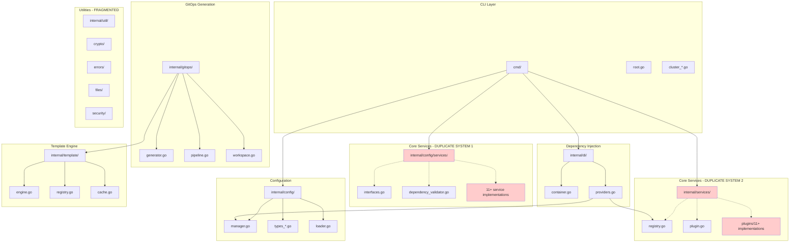
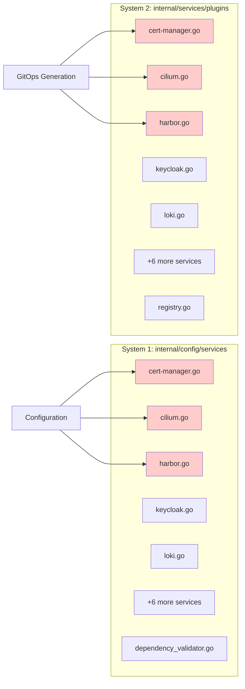
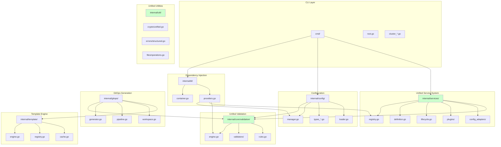
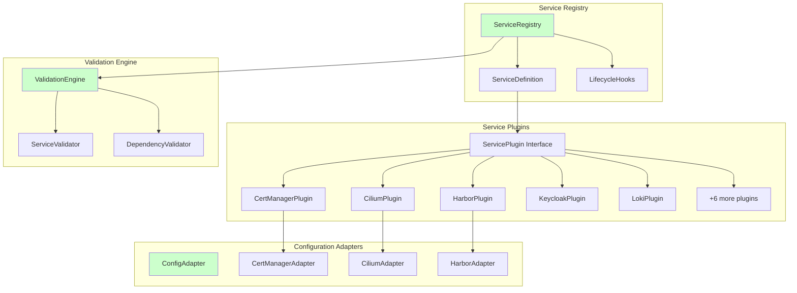
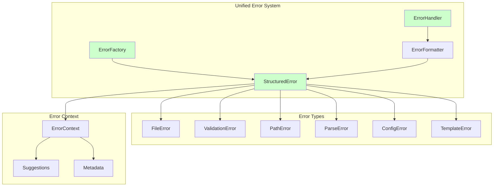
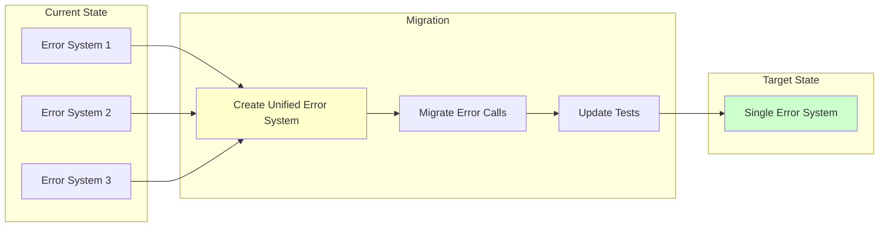
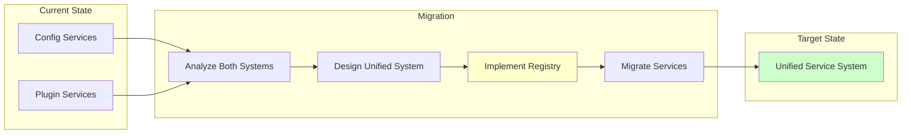
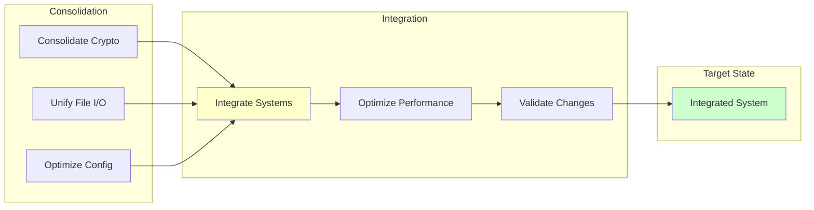
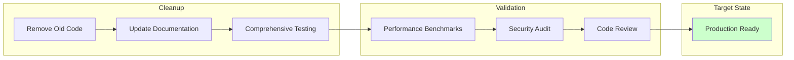

# Architecture Diagrams: Current vs Proposed

**Project**: opencenter-cli  
**Review Date**: February 4, 2026

## Table of Contents

- [Overview](#overview)
- [Current Architecture](#current-architecture)
- [Proposed Architecture](#proposed-architecture)
- [Migration Path](#migration-path)
- [Component Comparisons](#component-comparisons)

## Overview

This document provides visual representations of the current and proposed architectures for opencenter-cli. The diagrams use Mermaid syntax for clarity and can be rendered in most modern markdown viewers.

### Legend

```
┌─────────┐
│ Package │  = Go package
└─────────┘

┌─────────┐
│ Service │  = Service implementation
└─────────┘

───────────  = Dependency/Import
═══════════  = Strong coupling
- - - - - -  = Weak coupling/Interface
```

## Current Architecture

### High-Level System Architecture




### Problem: Dual Service Architecture




**Issues**:
- 11+ services implemented twice
- Different validation logic in each system
- Confusion about which system to use
- Changes must be made in both places
- Inconsistent behavior between systems

### Error Handling Fragmentation

```mermaid
graph TB
    subgraph "Error System 1: internal/config/errors.go"
        CE1[NewFileError]
        CE2[NewValidationError]
        CE3[NewPathError]
        CE4[NewParseError]
        CE5[WrapFileError]
        CE6[IsFileNotFoundError]
    end
    
    subgraph "Error System 2: internal/util/errors/"
        UE1[HandleError]
        UE2[CreateValidationError]
        UE3[NewDefaultErrorHandler]
        UE4[StructuredError]
    end
    
    subgraph "Error System 3: internal/config/flags/errors.go"
        FE1[ConfigError]
        FE2[ErrorBuilder]
        FE3[ErrorReporter]
        FE4[CreateTemplatedError]
    end
    
    CMD[Commands] --> CE1
    CMD --> UE1
    CMD --> FE1
    
    CONFIG[Config Package] --> CE2
    CONFIG --> UE2
    
    SERVICES[Services] --> CE3
    SERVICES --> UE3
    
    style CE1 fill:#ffffcc
    style CE2 fill:#ffffcc
    style UE1 fill:#ffffcc
    style UE2 fill:#ffffcc
    style FE1 fill:#ffffcc
```



**Issues**:
- Three separate error creation systems
- Inconsistent error formats
- Duplicate validation error logic
- No unified error handling strategy

## Proposed Architecture

### Unified System Architecture



### Unified Service Architecture



**Benefits**:
- Single source of truth for services
- Consistent validation across all services
- Clear separation: plugins for logic, adapters for config
- Unified lifecycle management
- Extensible plugin system

### Unified Error Handling



**Benefits**:
- Single error type with all necessary fields
- Consistent error formatting
- Automatic suggestion generation
- Unified error handling strategy
- Easy to extend with new error types

## Migration Path

### Phase 1: Foundation (Week 1)



### Phase 2: Core Services (Week 2)



### Phase 3: Integration (Week 3)



### Phase 4: Cleanup (Week 4)



## Component Comparisons

### Service System Comparison

| Aspect | Current (Dual System) | Proposed (Unified) |
|--------|----------------------|-------------------|
| **Service Definitions** | 2 locations (11+ duplicates) | 1 location |
| **Validation** | Scattered, inconsistent | Centralized, consistent |
| **Lifecycle** | Partial support | Full lifecycle hooks |
| **Dependencies** | Manual tracking | Automatic resolution |
| **Extensibility** | Limited | Plugin-based |
| **Testing** | Duplicate tests | Single test suite |
| **Maintenance** | High (2x effort) | Low (1x effort) |

### Error Handling Comparison

| Aspect | Current (Triple System) | Proposed (Unified) |
|--------|------------------------|-------------------|
| **Error Types** | 3 separate systems | 1 unified system |
| **Consistency** | Inconsistent formats | Consistent format |
| **Suggestions** | Partial support | Automatic suggestions |
| **Context** | Limited | Rich context |
| **Testing** | Fragmented | Centralized |
| **Maintenance** | High (3x effort) | Low (1x effort) |

### Validation Comparison

| Aspect | Current (Scattered) | Proposed (Unified) |
|--------|-------------------|-------------------|
| **Validators** | Multiple locations | Single engine |
| **Dependencies** | Manual checking | Automatic resolution |
| **Circular Deps** | Partial detection | Full detection |
| **Extensibility** | Limited | Plugin-based |
| **Testing** | Duplicate tests | Single test suite |
| **Maintenance** | Medium effort | Low effort |

## Conclusion

The proposed architecture eliminates duplication, provides clear separation of concerns, and establishes a single source of truth for services, errors, and validation. The migration path is designed to minimize risk through phased implementation with comprehensive testing at each stage.

**Key Improvements**:
- 20-25% code reduction through service unification
- 10-15% code reduction through error handling consolidation
- 10-15% code reduction through validation consolidation
- Improved maintainability and developer experience
- Consistent behavior across all components
- Clear extension points for future features

**Next Steps**: Review these diagrams with the development team and proceed with Phase 1 of the refactoring roadmap.
