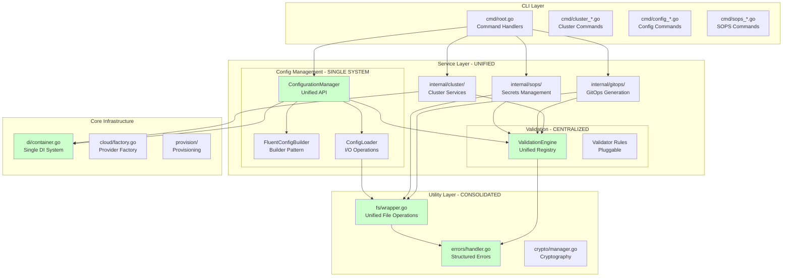
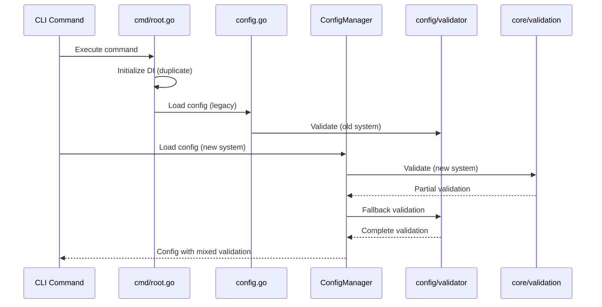
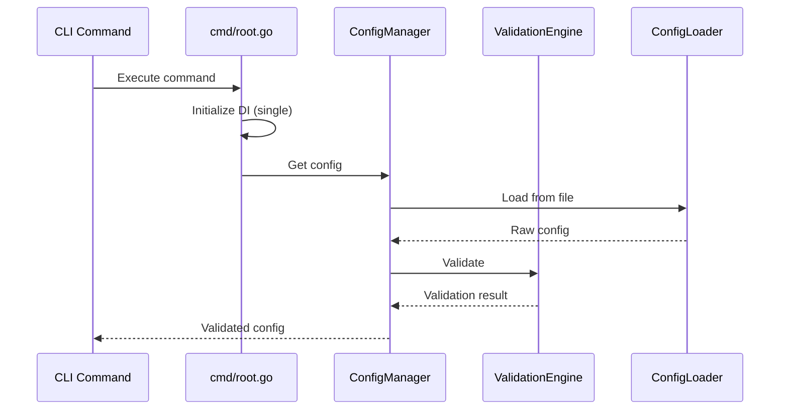
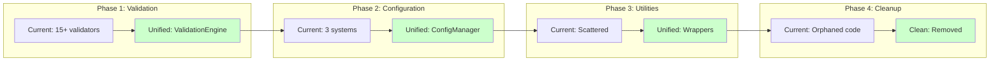

# Architectural Diagrams: Current vs. Proposed

## Current Architecture (As-Is)

```mermaid
graph TB
    subgraph "CLI Layer"
        CMD[cmd/root.go<br/>Command Handlers]
        CLUSTER[cmd/cluster_*.go<br/>Cluster Commands]
        CONFIG_CMD[cmd/config_*.go<br/>Config Commands]
        SOPS_CMD[cmd/sops_*.go<br/>SOPS Commands]
    end

    subgraph "Service Layer - FRAGMENTED"
        CLUSTER_SVC[internal/cluster/<br/>Cluster Services]
        
        subgraph "Config Management - 2 SYSTEMS"
            CONFIG_LEGACY[config.go<br/>Legacy Functions]
            CONFIG_MGR[manager.go<br/>ConfigurationManager]
            CONFIG_BUILDER[builder.go<br/>FluentConfigBuilder]
        end
        
        subgraph "Validation - SCATTERED"
            VAL_CONFIG[config/validator.go]
            VAL_SOPS[sops/validator.go]
            VAL_GITOPS[gitops/validators.go]
            VAL_SERVICES[services/plugins/<br/>15+ validators]
        end
        
        GITOPS[internal/gitops/<br/>GitOps Generation]
        SOPS[internal/sops/<br/>Secrets Management]
    end

    subgraph "Infrastructure Layer"
        DI_ROOT[cmd/root.go<br/>DI Init - DUPLICATE]
        DI_SETUP[di/setup.go<br/>DI Init - DUPLICATE]
        DI_CONTAINER[di/container.go<br/>DI Container]
        
        CLOUD[cloud/factory.go<br/>Provider Factory]
        PROVISION[provision/<br/>Provisioning]
    end

    subgraph "Utility Layer - DUPLICATED"
        UTIL_FILES[util/files/<br/>File Operations]
        UTIL_ERRORS[util/errors/<br/>Error Handling]
        UTIL_CRYPTO[util/crypto/<br/>Cryptography]
        
        FILES_SCATTERED[50+ os.ReadFile<br/>SCATTERED]
        ERRORS_MIXED[fmt.Errorf + StructuredError<br/>INCONSISTENT]
    end

    CMD --> CLUSTER_SVC
    CMD --> CONFIG_LEGACY
    CMD --> CONFIG_MGR
    CMD --> GITOPS
    CMD --> SOPS
    
    CLUSTER_SVC --> VAL_CONFIG
    
    CONFIG_MGR --> VAL_CONFIG
    CONFIG_BUILDER --> VAL_CONFIG
    
    GITOPS --> VAL_GITOPS
    SOPS --> VAL_SOPS
    
    CLUSTER_SVC --> DI_ROOT
    CLUSTER_SVC --> DI_SETUP
    
    GITOPS --> FILES_SCATTERED
    SOPS --> FILES_SCATTERED
    CONFIG_LEGACY --> FILES_SCATTERED
    
    style CONFIG_LEGACY fill:#ffcccc
    style DI_ROOT fill:#ffcccc
    style FILES_SCATTERED fill:#ffcccc
    style ERRORS_MIXED fill:#ffcccc
    style VAL_SERVICES fill:#ffcccc
```



### Current Architecture Issues

**Red Boxes = Problem Areas:**

1. **Config Management Fragmentation**
   - 2 different systems for configuration management (legacy + manager)
   - Duplicate path resolution logic

2. **Validation Scattered**
   - 15+ separate validator implementations
   - No unified error format

3. **DI Container Duplication**
   - Two initialization points (root.go + setup.go)
   - Inconsistent container access patterns

4. **File Operations Scattered**
   - 50+ direct `os.ReadFile`/`os.WriteFile` calls
   - No centralized error handling
   - Inconsistent permission handling

---

## Proposed Architecture (To-Be)



### Proposed Architecture Benefits

**Green Boxes = Improved Areas:**

1. **Unified Config Management**
   - Single `ConfigurationManager` with clear API
   - Builder pattern for construction
   - Centralized loading/saving

2. **Centralized Validation**
   - Single `ValidationEngine` with pluggable rules
   - Consistent error format
   - Reusable validators

3. **Single DI System**
   - One initialization point
   - Clear dependency graph
   - Better testability

4. **Consolidated Utilities**
   - Unified file operations wrapper
   - Structured error handling
   - Consistent patterns

---

## Component Interaction Flow

### Current Flow (Complex)



### Proposed Flow (Simplified)



---

## Migration Path Visualization



---

## Dependency Graph Simplification

### Before (Complex Dependencies)

```
cmd/root.go
├── internal/config/config.go (legacy)
├── internal/config/manager.go (new)
├── internal/config/builder.go (builder)
├── internal/di/setup.go (duplicate init)
└── internal/di/container.go

internal/cluster/
├── internal/config/validator.go
└── internal/config/manager.go

internal/gitops/
├── internal/gitops/validators.go
├── os.ReadFile (50+ calls)
└── fmt.Errorf (inconsistent)
```

### After (Clean Dependencies)

```
cmd/root.go
├── internal/config/manager.go (unified)
└── internal/di/container.go (single)

internal/cluster/
├── internal/config/manager.go
└── internal/core/validation/engine.go

internal/gitops/
├── internal/core/validation/engine.go
├── internal/util/fs/wrapper.go
└── internal/util/errors/handler.go
```

---

## Key Metrics Comparison

| Metric | Current | Proposed | Improvement |
|--------|---------|----------|-------------|
| Config Systems | 2 | 1 | 50% reduction |
| Validator Files | 15+ | 1 engine + rules | 80% reduction |
| DI Init Points | 2 | 1 | 50% reduction |
| File Op Calls | 50+ scattered | 1 wrapper | 98% reduction |
| Error Patterns | 3 mixed | 1 structured | 67% reduction |
| LOC (internal/) | ~45,000 | ~34,000 | 25% reduction |

---

## Architecture Decision Records (ADRs)

### ADR-001: Unified Validation Engine
**Status:** Proposed  
**Decision:** Migrate all validation to `internal/core/validation.ValidationEngine`  
**Rationale:** Eliminate duplication, consistent error handling, easier testing

### ADR-002: Single Configuration Manager
**Status:** Proposed  
**Decision:** Consolidate to `internal/config.ConfigurationManager`  
**Rationale:** Clear API, better caching, reduced complexity

### ADR-003: Centralized File Operations
**Status:** Proposed  
**Decision:** Create `internal/util/fs.Wrapper` for all file I/O  
**Rationale:** Consistent error handling, easier mocking, atomic operations

### ADR-004: Structured Error Handling
**Status:** Proposed  
**Decision:** Use `internal/util/errors.StructuredError` everywhere  
**Rationale:** Better error context, consistent formatting, easier debugging
