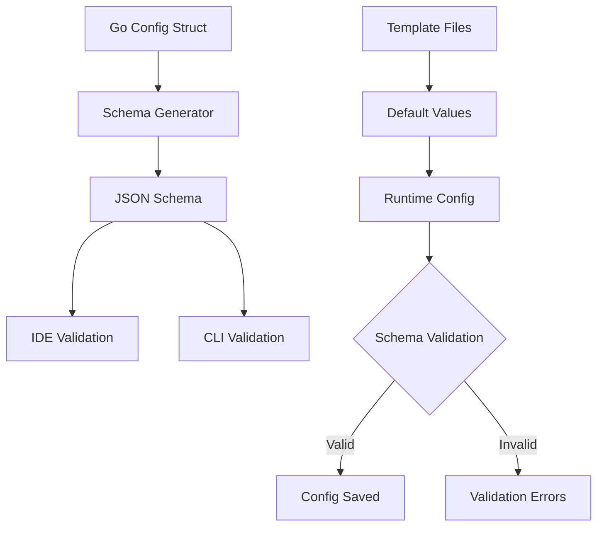

# Schema Generation in openCenter

This document explains how JSON schema generation works in openCenter, particularly in relation to the template system and IaC configuration validation.

## Overview

openCenter uses **automatic JSON schema generation** from Go struct definitions to provide IDE validation, CLI validation, and documentation. The schema is not manually maintained but generated from the codebase itself, ensuring consistency between runtime behavior and validation rules.

## How Schema Generation Works

### 1. Go Struct as Source of Truth

The JSON schema is generated directly from the `Config` struct in `internal/config/config.go`:

```go
type Config struct {
    ClusterName   string       `yaml:"cluster_name" json:"cluster_name"`
    Template      string       `yaml:"template,omitempty" json:"template,omitempty"`
    NamingPrefix  string       `yaml:"naming_prefix,omitempty" json:"naming_prefix,omitempty"`
    // ... other fields
    IAC           IAC          `yaml:"iac" json:"iac"`
    Cloud         Cloud        `yaml:"cloud" json:"cloud"`
    // ...
}
```

### 2. Schema Generation Command

Generate the complete JSON schema using:

```bash
# Generate and display schema
./bin/openCenter cluster schema --pretty

# Save to file for IDE integration
./bin/openCenter cluster schema --out schema/cluster.schema.json
```

### 3. Automatic Field Detection

The schema generator uses Go reflection to:
- Detect all struct fields and their types
- Convert Go types to JSON schema types
- Honor struct tags for additional metadata
- Include validation rules and constraints

Example type mappings:
```go
string              → {"type": "string"}
bool                → {"type": "boolean"}
int                 → {"type": "integer"}
[]string            → {"type": "array", "items": {"type": "string"}}
map[string]any      → {"type": "object", "additionalProperties": true}
```

## Template System and Schema Relationship

### Schema Structure vs Template Content

**Critical distinction**: The schema defines *structure* (what fields are allowed), while templates define *content* (default values for those fields).

```yaml
# Schema defines structure (same for all templates):
iac:
  main: {}      # Any key-value pairs allowed
  modules: {}   # Any nested objects allowed

# Templates provide different content:
# OpenStack: openstack_auth_url, flavor_master, etc.
# Kind: kubernetes_version, registry_enabled, etc.
# VMware: vcenter_server, datacenter, cluster, etc.
```

### Flexible IaC Schema Design

The IaC section uses flexible typing to accommodate any infrastructure configuration:

```go
type IAC struct {
    MainTF  string                 `yaml:"main_tf,omitempty" json:"main_tf,omitempty"`
    Main    map[string]any         `yaml:"main,omitempty" json:"main,omitempty"`        // ← Flexible
    Modules map[string]any         `yaml:"modules,omitempty" json:"modules,omitempty"`  // ← Flexible
}
```

This generates schema that accepts any key-value structure:
```json
{
  "iac": {
    "properties": {
      "main": {
        "type": "object",
        "additionalProperties": true
      },
      "modules": {
        "type": "object",
        "additionalProperties": {
          "type": "object",
          "additionalProperties": true
        }
      }
    }
  }
}
```

## Template Loading Process

### Runtime Template Resolution

1. **Template Selection**: User specifies template via `--template=kind`
2. **Template Loading**: `getTemplateIACYAML()` loads appropriate YAML file
3. **Content Parsing**: Template YAML parsed into `map[string]any`
4. **Config Population**: Maps assigned to flexible IAC fields
5. **Schema Validation**: Final config validated against generated schema

```go
// Template loading example
templateYAML := getTemplateIACYAML("kind")  // Loads iac-kind.yaml
var seed struct {
    Locals  map[string]any `yaml:"locals"`
    Modules map[string]any `yaml:"modules"`
}
yaml.Unmarshal([]byte(templateYAML), &seed)

// Population of flexible fields
iac.Main = seed.Locals     // Any key-value pairs accepted
iac.Modules = seed.Modules // Any nested structure accepted
```

### Template File Structure

Each template file follows the same structure but with different content:

```yaml
# internal/config/defaults/iac-kind.yaml
locals:
  cluster_name: "dev-cluster"
  kubernetes_version: "1.30.4"
  worker_count: 2
  # ... kind-specific locals

modules:
  kind-cluster:
    source: "github.com/rackerlabs/openCenter.git//install/iac/infra/kind?ref=main"
    cluster_name: 'local.cluster_name'
    kubernetes_version: 'local.kubernetes_version'
    # ... kind-specific module config
```

## Schema Validation Flow



## Adding New Templates

### Schema Impact: None Required

Adding new templates requires **no schema changes** because:
- Schema structure remains the same (`iac.main` and `iac.modules` accept any content)
- Only template content files need to be added
- New templates automatically validate against existing schema

### Steps to Add a New Template

1. **Create template file**: `internal/config/defaults/iac-newtemplate.yaml`
2. **Add to embed list**: Update `internal/config/embed_defaults.go`
3. **Add to template resolver**: Update `getTemplateIACYAML()` function
4. **Test generation**: Verify `cluster init --template=newtemplate` works

Example new template addition:
```go
// embed_defaults.go
//go:embed defaults/iac-newtemplate.yaml
var newtemplateIACYAML string

// config.go
func getTemplateIACYAML(template string) string {
    switch strings.ToLower(strings.TrimSpace(template)) {
    case "newtemplate":
        return newtemplateIACYAML
    // ... existing cases
    }
}
```

## Schema Generation Implementation

### Core Components

1. **Command Handler**: `cmd/cluster_schema.go` (likely location)
2. **Schema Generator**: Uses reflection to convert Go structs to JSON schema
3. **Output Formatters**: Pretty printing, file output options
4. **Validation Integration**: Schema used by config validation functions

### Schema Enhancement with Struct Tags

Additional schema properties can be specified via struct tags:

```go
type Config struct {
    ClusterName string `yaml:"cluster_name" json:"cluster_name" jsonschema:"required,description=Unique cluster identifier"`
    Template    string `yaml:"template,omitempty" json:"template,omitempty" jsonschema:"enum=openstack;kind;vmware;baremetal,description=Infrastructure template type"`
}
```

This would generate enhanced schema with validation rules and descriptions:
```json
{
  "cluster_name": {
    "type": "string",
    "description": "Unique cluster identifier"
  },
  "template": {
    "type": "string",
    "enum": ["openstack", "kind", "vmware", "baremetal"],
    "description": "Infrastructure template type"
  }
}
```

## Benefits of This Approach

### 1. Single Source of Truth
- Go structs define both runtime behavior and validation schema
- No duplicate schema maintenance required
- Guaranteed consistency between code and validation

### 2. Automatic Updates
- Adding fields to structs automatically updates schema
- Removing fields automatically removes from schema
- Type changes automatically reflect in validation

### 3. Template Extensibility
- `map[string]any` allows infinite template configurations
- New templates require no core schema changes
- Infrastructure-specific settings naturally supported

### 4. Developer Experience
- IDE autocomplete and validation via generated schema
- Compile-time type safety in Go code
- Runtime validation with clear error messages

### 5. Maintainability
- Schema always matches current codebase
- No manual schema updates required
- Reduces documentation drift

## IDE Integration

### VS Code Setup

1. Generate schema file:
   ```bash
   ./bin/openCenter cluster schema --out schema/cluster.schema.json
   ```

2. Configure VS Code settings:
   ```json
   {
     "yaml.schemas": {
       "./schema/cluster.schema.json": "*.yaml"
     }
   }
   ```

3. Enjoy autocomplete and validation in YAML files

### Schema File Management

- Schema files can be version-controlled for stable IDE experience
- Regenerate schema after significant struct changes
- Consider automating schema generation in CI/CD pipeline

## Advanced Schema Features

### Conditional Validation

The schema generator can create conditional validation rules:

```json
{
  "if": {
    "properties": {
      "opentofu": {
        "properties": {
          "backend": {
            "properties": {
              "type": {"const": "s3"}
            }
          }
        }
      }
    }
  },
  "then": {
    "properties": {
      "opencenter": {
        "required": ["aws_access_key", "aws_secret_access_key"]
      }
    }
  }
}
```

This enforces that S3 backend requires AWS credentials.

### Custom Validation Rules

Additional validation can be implemented in the `Validate()` function while keeping the base schema flexible:

```go
func Validate(cfg Config) []string {
    var errs []string

    // Template-specific validation
    switch cfg.Template {
    case "openstack":
        if cfg.Cloud.Provider != "openstack" {
            errs = append(errs, "openstack template requires cloud.provider=openstack")
        }
    case "kind":
        if cfg.Cloud.Provider != "local" {
            errs = append(errs, "kind template requires cloud.provider=local")
        }
    }

    return errs
}
```

## Troubleshooting Schema Issues

### Common Problems

1. **Schema out of sync**: Regenerate with `cluster schema` command
2. **Missing fields**: Check struct tags and field visibility
3. **Type mismatches**: Verify Go type mappings to JSON schema
4. **Template validation**: Ensure template content matches flexible schema structure

### Debugging Schema Generation

```bash
# Generate and inspect full schema
./bin/openCenter cluster schema --pretty | jq '.'

# Check specific field definitions
./bin/openCenter cluster schema --pretty | jq '.properties.iac'

# Validate example config against schema
./bin/openCenter cluster validate my-cluster
```

This automatic schema generation system provides robust validation while maintaining the flexibility needed for diverse infrastructure templates and configurations.